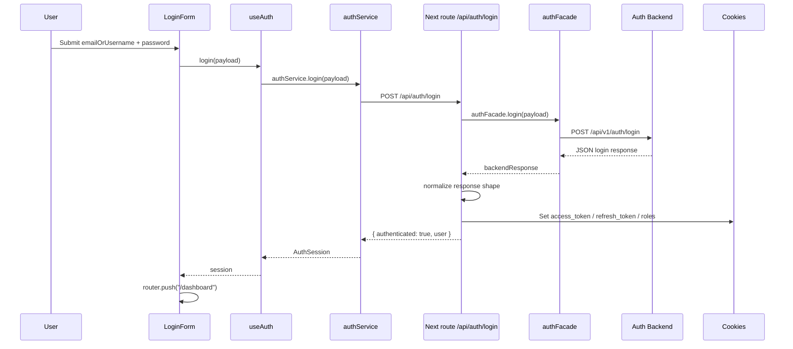

# Login Flow

This document describes the full login flow in the frontend, especially how the app receives the backend response and converts it into a browser session.

## Overview

The frontend does not call the auth backend directly from the login page.
It sends credentials to the internal Next.js route `POST /api/auth/login`.
That route forwards the request to the backend auth service, normalizes the backend response, stores auth data in HttpOnly cookies, and returns a small session object to the browser.

## End-To-End Flow



## Step 1: User submits the login form

The login form lives in [src/features/auth/components/login-form.tsx](src/features/auth/components/login-form.tsx).

When the user submits the form:

1. `onSubmit()` prevents the default browser submit.
2. It calls `login({ emailOrUsername, password })` from `useAuth()`.
3. If the returned session contains `authenticated: true`, the page redirects to `/dashboard`.

Expected payload sent from the browser:

```json
{
  "emailOrUsername": "user@example.com",
  "password": "secret"
}
```

## Step 2: Client auth hook calls internal API

The login hook is in [src/features/auth/hooks/use-auth.ts](src/features/auth/hooks/use-auth.ts).

What it does:

1. Sets loading state.
2. Clears previous error state.
3. Calls `authService.login(payload)`.
4. If successful, stores `session.user` in the local auth store.
5. If it fails, extracts `message` from the HTTP error response and shows it in the form.

The service call is in [src/features/auth/service.ts](src/features/auth/service.ts).

It sends:

- `POST /api/auth/login`
- `useBaseUrl: false`

That means the browser calls the app's own route handler, not the external backend URL directly.

## Step 3: HTTP client sends cookies automatically

The shared HTTP client is in [src/services/http.ts](src/services/http.ts).

Important behavior:

1. It uses `credentials: "include"`.
2. It parses JSON responses automatically.
3. Non-2xx responses throw `HttpError` with parsed response data attached.

`credentials: "include"` matters because after login, the browser must send auth cookies back to the app on later requests.

## Step 4: Next.js login route proxies to backend

The login route handler is in [src/app/api/auth/login/route.ts](src/app/api/auth/login/route.ts).

This route:

1. Reads the request body from the browser.
2. Calls `authFacade.login(payload)`.
3. Forwards the request to the backend auth service.
4. Normalizes the backend response.
5. Validates that an access token exists.
6. Sets HttpOnly cookies.
7. Returns a minimal frontend session object.

The backend forwarding code is split across:

- [src/features/auth/server/auth.facade.ts](src/features/auth/server/auth.facade.ts)
- [src/features/auth/server/auth.service.ts](src/features/auth/server/auth.service.ts)

The current backend endpoint used by the frontend is:

```text
POST {AUTH_SERVICE_BASE_URL}/api/v1/auth/login
```

## Step 5: Backend response is normalized

This is the key part of the flow.

The frontend does not assume the backend always returns exactly the same field names.
The login route normalizes the response before using it.

It currently checks top-level and nested objects under these keys:

- `data`
- `result`
- `payload`
- `body`

Then it tries to read the access token from any of these keys:

- `accessToken`
- `access_token`
- `token`
- `jwt`
- `jwtToken`

It tries to read the refresh token from:

- `refreshToken`
- `refresh_token`

It also pulls `user` and `roles` when they are present.

This prevents failures when the backend returns a valid token under a different name or inside a nested object.

### Example accepted backend responses

Top-level token:

```json
{
  "accessToken": "abc",
  "refreshToken": "xyz",
  "user": {
    "id": "1",
    "email": "user@example.com",
    "roles": ["user"]
  }
}
```

Snake case token:

```json
{
  "access_token": "abc",
  "refresh_token": "xyz"
}
```

Nested token:

```json
{
  "data": {
    "token": "abc",
    "user": {
      "id": "1",
      "email": "user@example.com",
      "roles": ["admin"]
    }
  }
}
```

## Step 6: Why the old error happened

The old implementation only accepted `responseData.accessToken`.

If the backend returned:

- `access_token`
- `token`
- `jwt`
- a nested object like `data.accessToken`

the frontend treated the login response as invalid and returned:

```json
{
  "message": "Missing access token from auth API"
}
```

with status `502`.

The current normalization step fixes that mismatch.

## Step 7: Cookies written after successful login

Cookie configuration is in [src/config/cookies.ts](src/config/cookies.ts).

On successful login, the route writes these cookies:

1. `access_token`
2. `refresh_token` if available
3. `roles` if available

Cookie behavior:

- `access_token`: HttpOnly, `sameSite: "lax"`, 15 minutes
- `refresh_token`: HttpOnly, `sameSite: "strict"`, 7 days
- `roles`: HttpOnly, `sameSite: "lax"`, 1 day

Because they are HttpOnly, client-side JavaScript cannot read the tokens directly.
That is intentional.

## Step 8: Response returned to the browser

After cookies are set, the route returns a lightweight JSON response:

```json
{
  "authenticated": true,
  "user": {
    "id": "1",
    "email": "user@example.com",
    "roles": ["user"]
  }
}
```

This response is used by the React app to:

1. update the in-memory auth store
2. decide whether to redirect to `/dashboard`

The token itself is not returned to client state. It is stored only in cookies.

## Step 9: Protected routes after login

Protected route logic is in [src/proxy.ts](src/proxy.ts).

After login succeeds:

1. the browser has `access_token`
2. requests to `/dashboard/*` and `/admin/*` include that cookie
3. the proxy checks whether the cookie exists
4. missing token redirects to `/login`
5. `/admin/*` also checks roles from the `roles` cookie

This is how the browser session becomes an authenticated app session.

## Error paths

Common failure cases:

1. Backend returns non-2xx: the route passes the backend error message/status back to the browser.
2. Backend is unreachable: `requestAuthBackend()` returns `502` with `Cannot reach backend auth API`.
3. Backend response has no usable access token: the route returns `502` with `Missing access token from auth API`.
4. Client request fails: `useAuth()` shows the error message in the login form.

## Environment requirement

The login proxy depends on `AUTH_SERVICE_BASE_URL`.

Example:

```env
AUTH_SERVICE_BASE_URL=http://localhost:8081
```

If this value is missing or wrong, the frontend cannot forward login requests to the auth backend.

## Short summary

The login flow works like this:

1. Browser submits credentials to the internal Next route.
2. Next route calls the backend auth API.
3. Backend JSON is normalized to find the token.
4. Next route stores auth data in HttpOnly cookies.
5. Browser receives `{ authenticated: true, user }`.
6. Frontend redirects to `/dashboard`.
7. Protected routes trust the cookies on later requests.
